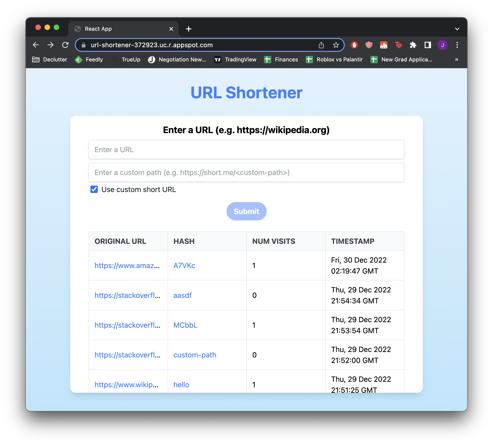

# URL Shortener



A URL Shortener built with React, Flask, and Tailwind CSS. The code is written in JavaScript and Python.

# Development

Starting the backend server for local development.
1. Create a python virtual environment.
2. Install the python modules found in 'requirements.txt' using pip.
3. 'flask run' to start up the backend server.

Starting the frontend server for local development.
1. 'npm install'
2. 'npm start'

To create a production ready build, use 'npm run build'.

The web application is intended to be deployed on a [Google App Engine](https://cloud.google.com/appengine) instance. You can start the application using the following command.

```bash
gcloud app deploy app.yaml api/backend.yaml dispatch.yaml
```
